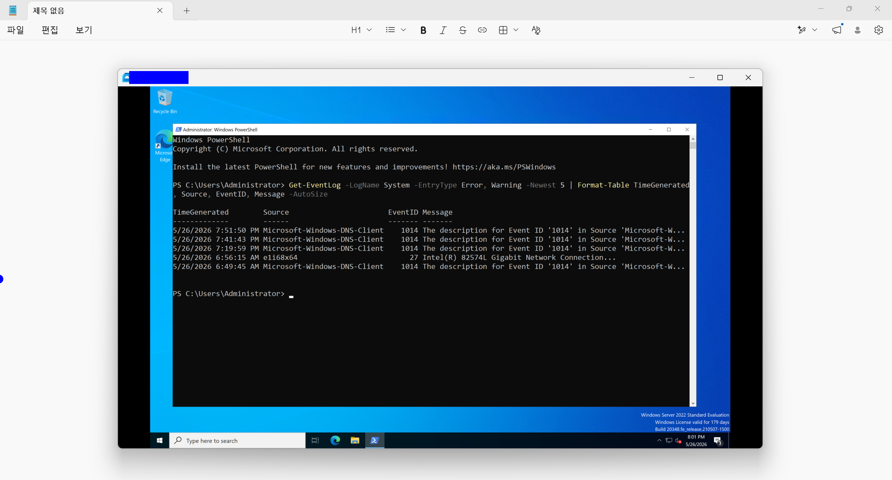
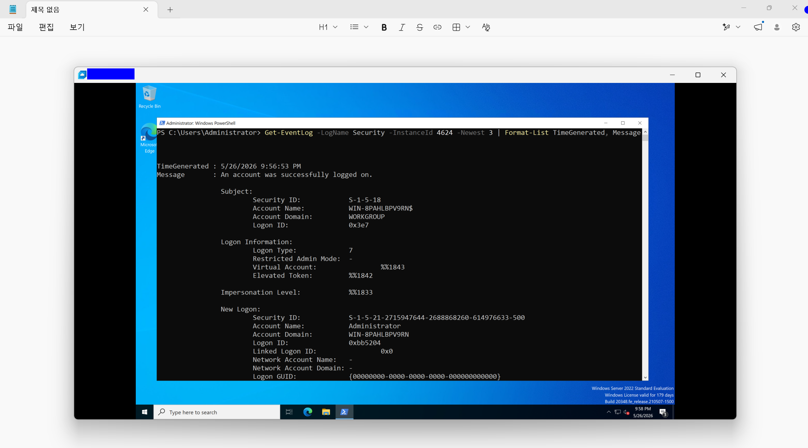

# Windows Server 2022 이벤트 로그 분석 및 작업 자동화 검증

## 1. 개요
- **목적**: Windows Server 2022 환경에서 GUI 마우스 조작을 배제하고 파워쉘(PowerShell) 인터페이스만을 활용하여 시스템 커널 및 보안 감사 로그를 진단하고, 작업 스케줄러를 통한 인프라 운영 자동화(Automation)를 실습함.
- **테스트 환경**:
  - **Host OS**: Windows 11 Home
  - **Guest OS**: Windows Server 2022 Standard Evaluation (Desktop Experience)
  - **Host IP 대역 (VMnet8)**: `192.168.58.xxx`
  - **Guest IP**: `192.168.58.xxx`

---

## 2. 시스템 커널 로그(System Log) 분석 및 진단

### [Step 1] Get-EventLog 활용 커널 핵심 로그 추출
- 파워쉘 명령어를 통해 시스템 단에서 발생한 최신 경고 및 에러 로그 5개를 선별하여 표 형태로 데이터 포맷팅을 수행함.

```powershell
Get-EventLog -LogName System -EntryType Error, Warning -Newest 5 | Format-Table TimeGenerated, Source, EventID, Message -AutoSize

```

### [Step 2] 추출 데이터 분석 및 안정성 검증

* **`EventID 1014 (DNS-Client)`**: 가상화 NAT 네트워크 환경에서 호스트 PC와의 링크 전환 시 발생하는 일시적인 DNS 응답 지연 경고 세션을 포착함. 시스템 다운을 유발하는 치명적인 크래시 요소가 아님을 확인 후 진단 종료함.
* **`EventID 27 (e1i68x64)`**: 인텔 기가빗 네트워크 가상 드라이버 인터페이스가 커널 단에 정상 바인딩되어 통신 링크를 유지하고 있음을 역으로 검증함.



---

## 3. 보안 감사 로그(Security Log) 분석 및 가용성 검증

### [Step 3] RDP 인증 세션 수립 흔적 역추적

* 시스템 로그인 성공 고유 식별 코드인 **`InstanceId 4624`** 조건 절을 바인딩하여 최신 보안 자격 증명 성공 감사 로그를 리스트 형식으로 정밀 역추적함.

```powershell
Get-EventLog -LogName Security -InstanceId 4624 -Newest 3 | Format-List TimeGenerated, Message

```

### [Step 4] 보안 자격 증명 데이터 팩트 체크

* **로그인 성공 판정**: `Message : An account was successfully logged on.` 구문을 식별하여 원격 및 내부 인프라 권한 획득 세션이 수립되었음을 확인함.
* **컨텍스트 명세**: `New Logon` 섹션의 최고 관리자 도메인 프로세스 권한이 내부 시스템 엔진(`services.exe`) 및 `Administrator` 자격 증명에 의해 안전하게 인덱싱 및 인가되었음을 데이터로 최종 교차 검증함.




---

## 4. 작업 스케줄러(Task Scheduler)를 통한 운영 자동화

### [Step 5] 백업 배치 스크립트 작성 및 스케줄러 예약 등록

* 매일 주기적으로 서버의 네트워크 인터페이스 상태를 기록하는 자동화 인프라 환경을 구축함.
* 파워쉘을 통해 백업 배치 파일(`C:\backup.bat`)을 생성하고, 매일 아침 9시마다 최고 권한(`SYSTEM`)으로 백엔드에서 자동 가동되도록 예약 작업을 코드로 등록함.

```powershell
$action = New-ScheduledTaskAction -Execute "C:\backup.bat"
$trigger = New-ScheduledTaskTrigger -Daily -At 9am
Register-ScheduledTask -TaskName "Daily_Network_Backup" -Action $action -Trigger $trigger -User "SYSTEM" -Description "Daily network interface backup automation script"

```


---

## 5. 느낀 점 (Lesson Learned)

* **데이터 기반의 주도적 장애 진단 역량**: GUI 마우스 클릭 환경이 완비된 데스크톱 익스피리언스 버전임에도 불구하고, 실제 실무의 코어 운영 표준에 맞춰 파워쉘 파이프라인(`|`) 명령어를 조합해 시스템 커널 내부의 상세 로그를 원하는 형태로 즉각 커스터마이징하여 추출하는 기법을 습득함.
* **자동화 중심의 인프라 효율성 인지**: 반복적인 인프라 백업 및 운영 업무를 작업 스케줄러를 통해 코드로 제어 및 등록해 보며, 시스템의 가용성을 유지하고 운영 리소스를 최소화하는 '실무 자동화 인프라 관리'의 본질을 배움.

```
