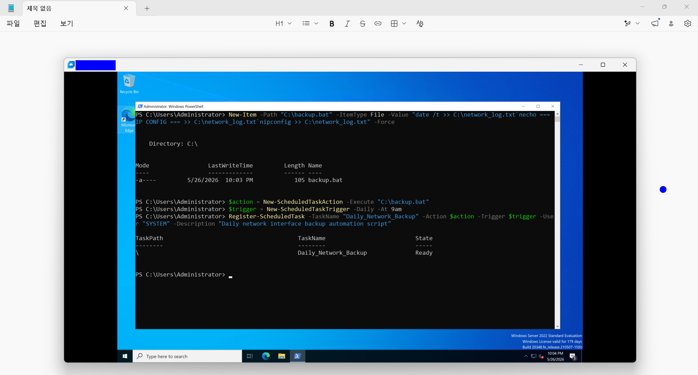

# Windows Server 2022 이벤트 로그 분석 및 작업 자동화 검증

## 1. 개요
- **목적**: Windows Server 2022 환경에서 PowerShell 기반으로 이벤트 로그를 확인하고, 작업 스케줄러(Task Scheduler)를 활용한 자동화 작업을 구성해보며 Windows 서버 운영 방식을 익힘.
- **테스트 환경**:
  - **Host OS**: Windows 11 Home
  - **Guest OS**: Windows Server 2022 Standard Evaluation (Desktop Experience)
  - **Host IP 대역 (VMnet8)**: `192.168.58.xxx`
  - **Guest IP**: `192.168.58.xxx`
---

## 2. 시스템 로그(System Log) 확인 및 분석

### [Step 1] PowerShell로 시스템 로그 확인
- PowerShell에서 `Get-EventLog` 명령어를 사용해 최근 시스템 경고 및 에러 로그를 확인함.

```powershell
Get-EventLog -LogName System -EntryType Error, Warning -Newest 5 | Format-Table TimeGenerated, Source, EventID, Message -AutoSize

```

### [Step 2] 로그 내용 확인

* EventID 1014 (DNS-Client) 로그가 반복적으로 발생하는 것을 확인함.
* VMware NAT 환경에서 네트워크 연결 과정 중 일시적으로 DNS 응답이 지연되며 발생한 경고 로그임을 확인했고, 서버 자체 문제는 아니었음.
* EventID 27 (e1i68x64) 로그를 통해 Intel 가상 네트워크 어댑터가 정상 동작 중인 것도 함께 확인함.


▲ PowerShell에서 최근 시스템 경고 및 에러 로그를 조회한 화면

---

## 3. 보안 로그(Security Log) 확인 및 로그인 기록 분석

### [Step 3] 로그인 성공 로그 확인

* PowerShell에서 `InstanceId 4624` 조건으로 로그인 성공 이벤트 로그를 조회함.

```powershell
Get-EventLog -LogName Security -InstanceId 4624 -Newest 3 | Format-List TimeGenerated, Message

```

### [Step 4] 로그 내용 확인

* An account was successfully logged on. 메시지를 통해 로그인 성공 기록이 정상적으로 저장되는 것을 확인함.
* New Logon 항목에서 Administrator 계정으로 로그인된 기록을 확인했고, 원격 접속 및 관리자 권한 로그가 정상적으로 남는 것도 함께 확인함.


▲ PowerShell에서 로그인 성공(Security Event ID 4624) 로그를 조회한 화면


---

## 4. 작업 스케줄러(Task Scheduler)를 활용한 자동화 설정

### [Step 5] 백업 스크립트 생성 및 예약 작업 등록

* - 네트워크 상태를 주기적으로 기록하기 위해 `backup.bat` 파일을 생성함.
* PowerShell에서 작업 스케줄러(Task Scheduler)를 등록하여 매일 오전 9시에 자동 실행되도록 설정함.

```powershell
$action = New-ScheduledTaskAction -Execute "C:\backup.bat"
$trigger = New-ScheduledTaskTrigger -Daily -At 9am
Register-ScheduledTask -TaskName "Daily_Network_Backup" -Action $action -Trigger $trigger -User "SYSTEM" -Description "Daily network interface backup automation script"

```


▲ PowerShell에서 예약 작업(Daily_Network_Backup)을 등록한 화면

---

## 5.Lesson Learned

* PowerShell 명령어를 사용해 Windows 이벤트 로그를 직접 조회하고 필요한 정보만 확인하는 방법을 익힘.
* 작업 스케줄러(Task Scheduler)를 통해 반복 작업을 자동화하면서 서버 운영에서 자동화의 중요성을 체감할 수 있었음.
```
