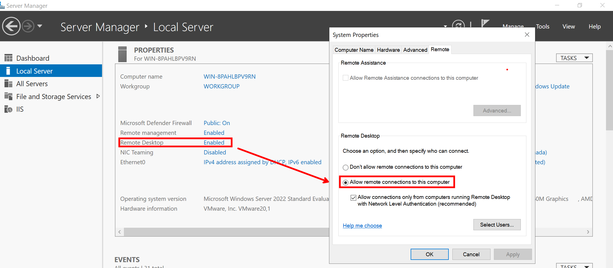
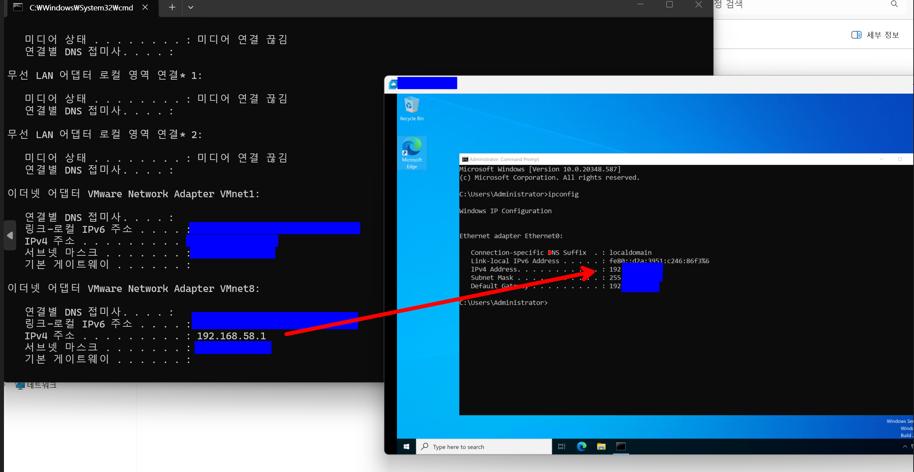

# Windows Server 2022 RDP 원격 관리 구성 및 네트워크 연동 검증

## 1. 실습 목적
- 노트북(호스트 PC)에 구축해 둔 VMware 가상화 환경에서 Windows Server 2022 가상 머신의 원격 데스크톱(RDP, 3389 포트) 기능을 직접 활성화해 보고, 실제로 외부에서 서버로의 원격 접속이 안정적으로 잘 이루어지는지 제어 프로세스를 확인해 보기 위함임.
- **테스트 환경 사양**:
  - **Host OS**: Windows 11
  - **Guest OS**: Windows Server 2022 Datacenter Core
  - **Host IP 대역 (VMnet8)**: `192.168.58.xxx`
  - **Guest IP**: `192.168.58.xxx`

---

## 2. Windows Server RDP 활성화 단계

### [Step 1] 시스템 원격 데스크톱 서비스 개방
1. 가상 윈도우 서버 내부의 `Server Manager` -> `Local Server` 메뉴로 이동함.
2. 기본적으로 문이 닫혀 있는(`Disabled`) `Remote Desktop` 항목을 클릭하여 시스템 속성 창을 열었음.
3. **`Allow remote connections to this computer`** 옵션을 선택하여 외부에서 원격 접속 요청을 정상적으로 수신할 수 있도록 대기 상태를 활성화함.

### [Step 2] 방화벽 인바운드 허용 상태 연동 검증
1. 설정이 실제 방화벽 엔진에도 잘 물렸는지 검증하기 위해 Windows Defender 고급 보안 방화벽 정책 관리자(`Inbound Rules`)로 이동함.
2. 위에서 RDP 서비스를 개방하자마자, 시스템이 수동 조작 없이도 내장 규칙인 **`Remote Desktop - User Mode (TCP-In)` (기본 포트 3389)** 정책을 알아서 허용(`Enabled`) 상태로 깔끔하게 자동 연동해 준 것을 팩트 체크함.

---

## 3. 호스트 PC-게스트 서버 원격 제어 최종 연동

### [Step 3] RDP 클라이언트를 통한 보안 세션 수립 및 검증
1. 내 노트북(호스트)에서 원격 데스크톱 연결 프로그램을 실행한 뒤, 대상 가상 머신의 사설 IP 주소(`192.168.58.xxx`)를 목적지로 지정하고 커넥션을 던졌음.
2. 가상 서버의 최고 관리자 계정인 **`Administrator`**와 패스워드를 정확하게 입력하여 자격 증명 인증 단계를 수행함.
3. 사설 인증서 경고 창에서 `예`를 누르고 진입하자, 내 노트북 화면 위에 가상 머신 서버 화면이 독립된 원격 창 형태로 시원하게 열리며 제어권이 완벽하게 확보되는 것을 최종 확인함.

*▲ [📸 05_rdp_connected_v2.png] 호스트 PC와 가상 머신 서버 간의 RDP(3389) 보안 세션 수립 및 원격 관리 가용성 최종 검증 완료 화면*

---

## 4. Lesson Learned
- **유기적인 OS 방화벽 연동 메커니즘 체감**: OS단에서 특정 원격 관리 서비스를 활성화했을 때 시스템 방화벽이 알아서 해당 포트(3389)를 매핑하고 열어주는 흐름을 눈으로 직접 확인하면서, 인프라 운영 체제가 가진 자동화 연동 정책의 편의성을 깊이 체감했습니다.
- **원격 관리 인프라의 실무적 가치**: 대부분의 인프라 운영 및 제어 업무가 원격 환경을 기반으로 수행되는 실무 흐름에 맞춰, 격리된 로컬 환경에서도 가상 머신에 안전하게 원격 프로토콜로 액세스하는 표준 관리 방식을 실습해 볼 수 있었습니다. 실무 지향적인 원격 인프라 운영 및 장애 대응 환경에 유연하게 적응할 수 있는 유의미한 기본기를 배양한 과정이었습니다.
