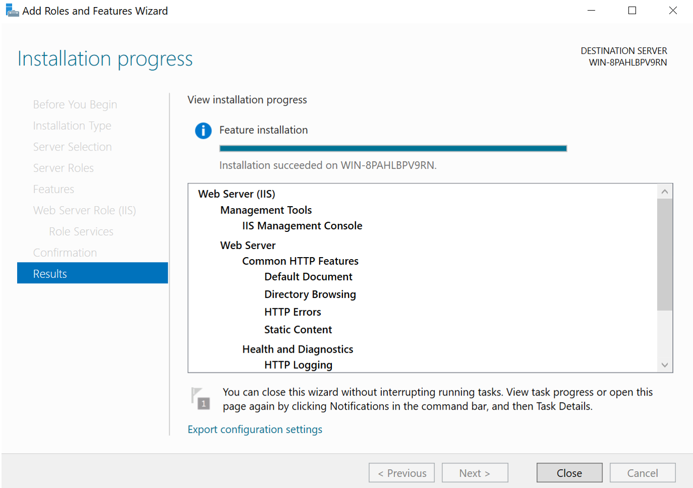
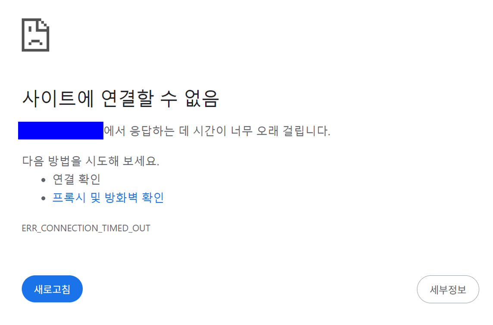
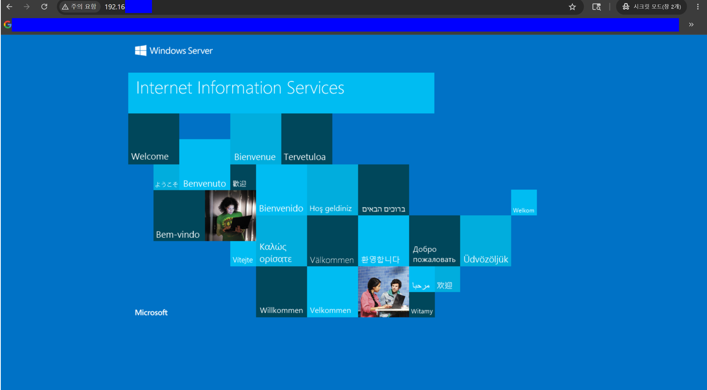

# 📝 Windows Server 2022 기반 IIS 웹 서버 구축 및 인바운드 방화벽 통제

## 1. 인프라 구축 및 검증 개요
- **목적**: 온프레미스(On-Premise) 가상화 환경에서 Windows Server 2022 기반의 IIS 웹 서버 역할을 프로비저닝하고, 고급 보안 방화벽 인바운드 정책 통제를 통해 호스트-게스트 간 내부 네트워크 가용성을 확보함.
- **아키텍처 스펙**:
  | 분류 | 상세 사양 |
  | :--- | :--- |
  | **Host OS** | Windows 11 Home |
  | **Hypervisor** | VMware Workstation |
  | **Guest OS** | Windows Server 2022 Standard Evaluation |
  | **Network Mode** | NAT (Network Address Translation) |
  | **Target 사설 IP** | `192.168.0.100` (보안상 마스킹 주소 대체) |
---

## 2. 웹 서버 (IIS) 및 관리 컴포넌트 프로비저닝

### [Step 1] Server Manager를 통한 가동
1. 게스트 OS 내 `Server Manager(서버 관리자)` 대시보드 진입 후 `Add Roles and Features` 마법사 구동.
2. `Server Roles` 단계에서 **`Web Server (IIS)`** 패키지 선택.
3. 웹 서비스 핸들링 및 바인딩 제어를 위해 하위 관리 도구인 **`Management Tools -> IIS Management Console`**이 누락 없이 인스턴스화되는지 종속성(Dependency) 검증 후 설치 완료.

*▲ [📸 01_iis_completed.png] IIS 웹 서버 및 웹 관리 콘솔 컴포넌트 설치 완료 명세*

---

## 3. 네트워크 통신 검증 및 방화벽 차단 식별

### [Step 2] 기본 인바운드 정책 비활성화를 통한 외부 통신 격리
1. 게스트 OS 내부 루프백 주소(`http://localhost`) 접근 시 웹 엔진이 정상 작동함을 확인.
2. 외부망 가용성 검증을 위해 호스트 PC(로컬 노트북) 브라우저에서 게스트 가상 머신의 사설 IP(`http://192.168.0.100`)로 인바운드 접속 시도.

**[현상 및 원인 분석]**
- 호스트 브라우저에서 무한 루프 발생 후 `ERR_CONNECTION_TIMED_OUT` (시간 초과) 에러 반환하며 접근 실패.
- **원인**: 명확한 인프라 접근 제어 검증을 위해 `Windows Defender Firewall with Advanced Security` 내 기본 활성화된 레거시 웹 트래픽 규칙 그룹을 수동으로 전부 **Disable(비활성화)** 처리하여 패킷 차단(`DROP`) 상태를 유도함.

*▲ [📸 02_host_timeout.png] 고급 보안 방화벽 정책 통제에 따른 호스트 PC 접근 타임아웃 현상 식별*

---

## 4. 커스텀 인바운드 방화벽 규칙 지정 및 가용성 복구

### [Step 3] 환경 변수 대응을 위한 커스텀 HTTP_80_ALLOW 규칙 재수립
- **기본 환경의 변수 포착**: IIS 역할 추가 완료 시, 하이퍼바이저 자동 설치(Easy Install) 및 OS 프로필에 의해 기본 웹 트래픽 규칙(`World Wide Web Services (HTTP-In)`)이 사전에 자동 활성화되어 외부 통신이 즉시 허용되는 현상을 식별함.
- **인프라 제어권 확보를 위한 역발상 조치**: 자동 생성된 기본 규칙들에 의존하지 않고, 인바운드 트래픽을 명확히 제어 및 검증하기 위해 기존 내장 규칙들을 모두 **Disable(비활성화)**하여 강제로 차단(`DROP`) 상태를 만듦. 이후, 직접 제어 가능한 전용 보안 규칙을 아래와 같이 수동으로 재수립함.

1. `Inbound Rules(인바운드 규칙)` -> `New Rule...` 마법사 실행.
2. **Rule Type**: `Port` / **Protocol**: `TCP` / **Specific Local Port**: `80` 지정.
3. **Action**: `Allow the connection` 설정. (※ IPsec 암호화 터널링 요구 옵션인 `Allow if it is secure`를 배제하고 일반 HTTP 패킷 수신이 가능하도록 정책 최적화)
4. **Rule Name**: `HTTP_80_ALLOW` 규칙 명시 후 정책 엔진에 최종 반영.

*▲ [📸 03_firewall_rule_applied.png] 자동화 규칙 비활성화 후, 명시적 제어를 위해 수동 수립한 HTTP_80_ALLOW 인바운드 보안 정책 명세*

---

### [Step 4] 최종 외부 통신 복구 완료 검증
- 규칙 적용 완료 즉시 호스트 PC의 크롬 시크릿 브라우저(캐시 메모리 간섭 제거 상태)를 통해 게스트 가상 머신 IP(`http://192.168.0.100`)로 재접속 수행.
- 백그라운드 커널에서 80포트 패킷 리스닝이 허용되면서 호스트 화면에 파란색 IIS 웰컴 메인 레이아웃이 즉각 출력되며 양방향 가용성 복구 완료를 검증함.

*▲ [📸 04_iis_connection_success.png] 커스텀 방화벽 규칙 활성화 후 호스트 PC를 통한 IIS 웹 가용성 복구 완료 검증*

---

## 5. Lesson Learned
- **가상화 레이어별 보안 제어 메커니즘 이해**: 모던 퍼블릭 클라우드(AWS) 인프라 환경은 하이퍼바이저 외부의 `Security Group(보안 그룹)` 레이어에서 인바운드를 1차 제어하지만, 온프레미스(VMware) 환경의 인프라 빌드업 시에는 게스트 OS 내부의 커널 방화벽 정책까지 엔지니어가 직접 명시적으로 제어해야 웹 서비스 라우팅이 원활해짐을 파악함. 클라우드와 온프레미스 간 하이브리드 아키텍처 설계 시 방화벽 통제 포인트의 차이점을 명확히 인지함.
